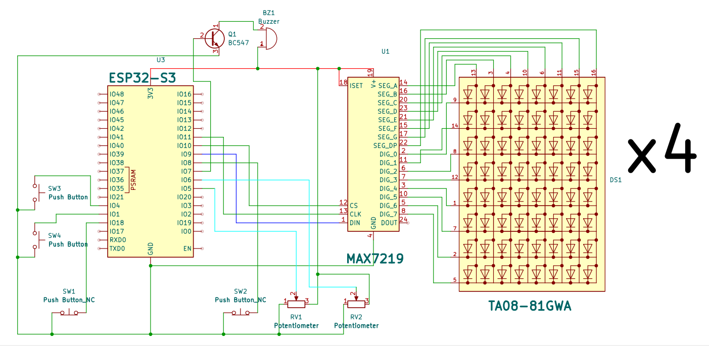

# Ping Pong with ESP32 and LED dot Matrix 8x32 MAX7219
## Introduction
This ping pong game will be implemented on an 8x32 LED dot matrix with rules similar to real-world ping pong. There are two players, each controlled using a slider potentiometer. Players are required to put the ball into the opponent's goal and defend their own goal from being scored on by deflecting the ball or doing a smash. The player who reaches a score of 11, and the player must be ahead by at least 2 points to win the set. If the score reaches 10-10, the player must continue playing until a difference of 2 points is reached. The player who achieves 3 sets of wins first is considered to have won the game.

# Technical Rules for the Ping Pong Game System

## 1. Player and Paddle Positions:
- **Each player controls a paddle on their side of the screen:**
  - **Player 1:** Paddle on the left side of the screen.
  - **Player 2:** Paddle on the right side of the screen.
- **Paddle Movement:**
  - The paddles move vertically using slider potentiometers.
- **Paddle Size:**
  - Each paddle consists of 3 LEDs.

## 2. Ball Mechanics:
- **Ball Movement:**
  - The ball moves automatically on the screen at a constant speed, except during a smash.
- **Ball Bounces:**
  - The ball bounces when it hits:
    1. The top or bottom walls of the screen.
    2. A player's paddle with the following details:
       - **Top or bottom of the paddle:** The ball bounces at a 45-degree angle in the opposite direction.
       - **Middle of the paddle:** The ball bounces straight in the opposite direction.
- **Scoring:**
  - If the ball passes a player's paddle, the opponent scores a point.

## 3. Scoring Rules:
- **Points:**
  - A player scores 1 point when the ball passes the opponent's paddle.
- **Game Point:**
  1. A set ends when one player reaches 11 points with a minimum 2-point lead (e.g., 11-9). The player wins the set.
  2. If the score is tied at 10-10, the game continues until a player achieves a 2-point lead.
- **Winning the Game:**
  - A player must win 3 sets to win the game.
- **Score Display:**
  - Scores are displayed on each player's side.
- **Set Indicator:**
  - The sets won are displayed using LED dots on each player's side.
- **Winner Display:**
  - When a player wins the game, their name is displayed (e.g., "P1 WIN" or "P2 WIN").

## 4. Smash Button Mechanism:
- **Each player has a smash button:**
  - **How it works:**
    1. Players can press the smash button when the ball is within their paddle area.
    2. If the button is pressed correctly:
       - The ball travels straight toward the opponent.
       - The ball's speed increases up to 3x.
    3. The button has no effect if the button is pressed at the wrong time (when the ball is not within the paddle area).
    4. Players can hold the smash button briefly to ensure a successful smash.

## 5. Ball Reset:
- After the ball goes out (passes a paddle):
  1. The ball resets to the centre of the screen.
  2. The ball is launched toward the player who last scored.

## 6. Additional Mechanism: Wall of Chance
- **Purpose:**
  - This mechanism allows players to create a "wall" in the middle of the play area to block the ball and prevent it from entering their side.
- **Wall Details:**
  1. The wall is 8 LEDs tall, fully blocking the vertical area.
  2. A player trailing by 2 points can press a button next to the smash button to activate the wall.
  3. The wall remains active for 5 seconds or until a player scores.
  4. The wall reflects the ball in a random direction, making it unpredictable for the opponent.

## 7. Sound Effects:
- A buzzer plays sounds during the following events:
  1. A player scores a point.
  2. A player wins a set.
  3. A player wins the game.
- Each event triggers a unique sound effect.

# Components Used in the Ping Pong Game System

## 1. **ESP32**
- The primary microcontroller for managing the game logic, controlling peripherals, and interfacing with the components.

## 2. **MAX7219 8x32 LED Dot Matrix Display Module**
- Used for displaying the game elements, such as paddles, the ball, scores, and game statuses.

## 3. **Potentiometer Slider**
- Used as a controller for players to move their paddles vertically on the LED matrix.

## 4. **Limit Switch (Normally Close)**
- Used for triggering smash.

## 5. **Passive Buzzer**
- Produces sound effects for events such as scoring, set wins, and game wins.

## 6. **Button (Normally Open)**
- Used for activating the "Wall of Chance."

---

### Notes:
- Ensure proper wiring and configuration of each component with the ESP32 to avoid damage.
- Test each component individually before integrating them into the system for smooth operation.

# Wiring Schematic

